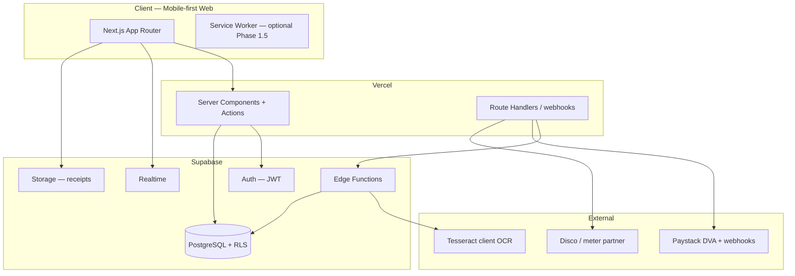
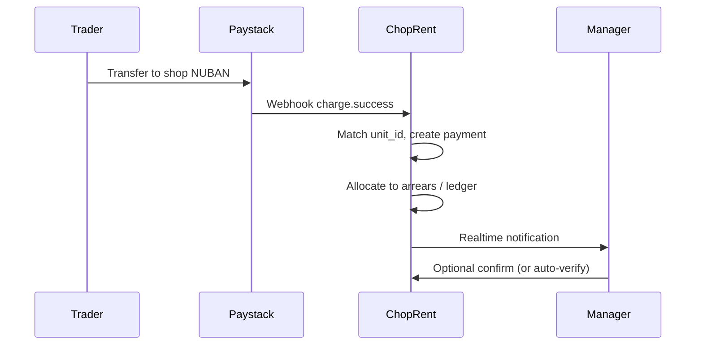

# ChopRent — System Architecture

**Version:** 0.2 (decisions locked)  
**Status:** Ready to scaffold — see [`03_decisions_log.md`](03_decisions_log.md).

---

## 1. Context

```mermaid
C4Context
  title ChopRent — System Context
  Person(tenant, "Tenant", "Pays rent, uploads bank receipt")
  Person(manager, "Manager", "Tenants, charges, verifies payments")
  Person(agent, "Agent", "Verifies payments — assigned sites only")
  Person(landlord, "Landlord", "Views portfolio performance")
  System(choprent, "ChopRent Web App", "Next.js on Vercel")
  SystemDb(supabase, "Supabase", "Postgres, Auth, Storage, Realtime")
  System_Ext(bank, "Tenant Bank", "Transfer to DVA or landlord account")
  System_Ext(paystack, "Paystack", "Dedicated virtual accounts + webhooks")
  System_Ext(disco, "Disco / meter API", "Electricity tokens — Phase 2")
  System_Ext(ai, "On-device OCR", "Tesseract — zero API cost")
  System_Ext(email, "Email", "Notifications; WhatsApp later")

  tenant --> choprent
  manager --> choprent
  landlord --> choprent
  choprent --> supabase
  tenant --> bank
  bank --> tenant
  tenant --> paystack
  choprent --> paystack
  choprent --> disco
  choprent --> ai
  choprent --> email
```

---

## 2. Logical architecture



**Principles**

- **RLS-first multi-tenancy:** every row scoped by `organization_id`; no cross-tenant reads.
- **Server authority:** ledger writes and verification state changes only via server actions or Edge Functions — never direct client UPDATE on `payments.verified_at`.
- **Event-ish ledger:** append payment attempts; verification is a state transition with auditor id.
- **Realtime read models:** dashboards subscribe to changes; heavy aggregates cached in materialized views refreshed on payment verify.

---

## 3. Deployment

| Environment | Web | Database | Notes |
|-------------|-----|----------|-------|
| Production | Vercel prod branch | Supabase prod | Custom domain |
| Preview | Vercel PR previews | Supabase staging project | Seed data only |
| Local | `pnpm dev` | Supabase CLI local or staging | `.env.local` |

**Secrets:** Vercel env vars for `NEXT_PUBLIC_SUPABASE_URL`, `SUPABASE_SERVICE_ROLE_KEY` (server only), AI keys, future gateway keys.

**CI:** GitHub Actions — lint, typecheck, `supabase db lint`, optional Playwright smoke.

---

## 4. Authentication & authorization

### Auth methods

- **Email magic link** and **phone OTP** — both supported
- Manager creates tenant profile with phone/email before first login
- First login: Terms + Privacy consent (`04_privacy_ndpr.md`)

### Role model

```
memberships (
  user_id,
  organization_id,
  role enum: owner | manager | agent
)

site_assignments (                 -- agents scoped to plazas
  user_id,
  site_id,
  role enum: agent
)

unit_assignments via leases (
  tenant_user_id,
  unit_id,
  lease_id
)
```

| Capability | owner (landlord) | manager | agent | tenant |
|------------|------------------|---------|-------|--------|
| Add plaza / add units | ✓ | | | |
| Set charges / leases (existing units) | ✓ | ✓ | | |
| Verify payments / record cash | ✓ | ✓ | ✓* | |
| View org dashboards | ✓ | ✓ | ✓* | |
| Issue management letters | ✓ | ✓ | | |
| Upload receipt | | | | ✓ |
| View ledger + download docs | | | | ✓ |
| Provision Paystack DVA (per unit) | ✓ | | | |

\*Agent: **assigned sites only** (`site_assignments`); cannot add units or plazas.

**Implementation:** Supabase Auth → `memberships` + `site_assignments` in RLS and Next.js middleware.

---

## 5. Data model (core entities)

### 5.1 Hierarchy — Plaza → Unit

```sql
organizations (
  id uuid PK,
  name text,
  slug text unique,
  settings jsonb,              -- gateway, DVA, fee_bearer, feature flags
  created_at timestamptz
)

sites (                          -- plaza; name entered by landlord
  id uuid PK,
  organization_id uuid FK,
  name text,
  site_type enum default plaza,
  address jsonb,
  created_at timestamptz
)

site_settlement_accounts (       -- multiple accounts per plaza
  id uuid PK,
  site_id uuid FK,
  bank_name text,
  account_number text,
  account_name text,
  is_default boolean,
  label text                    -- e.g. "Main rent", "Service charge"
)

units (
  id uuid PK,
  organization_id uuid FK,
  site_id uuid FK,
  unit_code text,              -- "14", "14/16", "14 & 16", "Shop 3B"
  unit_code_normalized text,   -- search helper
  is_composite boolean,        -- true for merged numbering
  composite_note text,         -- "Shops 14 and 16 combined"
  property_type enum,          -- shop | flat | office | warehouse | kiosk | parking | restaurant | other
  status enum vacant | occupied | maintenance,
  arrears_balance_ngn numeric default 0,  -- carried forward
  created_at timestamptz
)

unit_type_history (
  id uuid PK,
  unit_id uuid FK,
  from_type enum,
  to_type enum,
  changed_at timestamptz,
  changed_by uuid FK
)

unit_components (                -- optional: link composite to logical sub-units
  parent_unit_id uuid FK,
  child_unit_id uuid FK,
  relation enum merged | adjacent
)
```

**Composite units:** `unit_code` stores display string; billing treats as **one billable unit** unless later split (manager action with audit).

### 5.2 Leases & tenant assignment

Manager assigns phone/email → invite → tenant auth links to lease.

```sql
leases (
  id uuid PK,
  unit_id uuid FK,
  tenant_user_id uuid FK nullable,  -- set when tenant accepts invite
  tenant_display_name text,         -- trader business name on DVA
  tenant_phone text,
  tenant_email text,
  start_date date NOT NULL,
  end_date date NOT NULL,
  billing_cadence enum monthly | quarterly | annual,
  status enum draft | active | ended | renewed,
  renewed_from_lease_id uuid FK nullable,
  settlement_account_id uuid FK nullable,  -- which plaza bank account
  created_at timestamptz
)
```

**Renewal:** End current lease (`ended`), create new lease with `renewed_from_lease_id`. Arrears on unit row carry forward automatically.

**Tenant change on same unit:** End lease → new lease → update Paystack DVA **customer name** only; **NUBAN unchanged**.

### 5.3 Charge engine

```sql
charge_templates (
  id uuid PK,
  organization_id uuid FK,
  scope enum organization | site | property | unit | property_type,
  scope_id uuid nullable,
  charge_kind enum rent | service | agency | vat | diesel | security | deposit | other,
  calculation enum fixed | percent,
  amount numeric,              -- fixed ₦ or percentage value
  percent_of enum base_rent | charge_id,
  billing_period enum,
  effective_from date,
  effective_to date nullable,
  priority int                 -- evaluation order
)

ledger_periods (
  id uuid PK,
  unit_id uuid FK,
  lease_id uuid FK,
  period_start date,
  period_end date,
  billing_cadence enum,
  status enum open | closed,
  expected_total_ngn numeric,
  paid_total_ngn numeric,
  arrears_opening_ngn numeric,   -- from prior periods
  arrears_closing_ngn numeric,
  UNIQUE(unit_id, period_start, billing_cadence)
)

ledger_lines (
  id uuid PK,
  ledger_period_id uuid FK,
  charge_template_id uuid FK nullable,
  description text,
  amount_ngn numeric,
  kind enum expected | adjustment | waiver
)
```

**Generation job:** Edge Function on lease start / anniversary / cron — expand templates → `ledger_lines`. **Annual default** for plaza shops; cadence per lease.

**Arrears:** On period close, unpaid balance → `units.arrears_balance_ngn` and next period `arrears_opening_ngn`. **Partial payments** apply: (1) oldest arrears, (2) current period charges, (3) credit balance if overpaid.

**Flexibility:** Percent charges on base rent; VAT as % or fixed; diesel/security as fixed add-ons.

### 5.4 Payments & audit trail

Matches checklist section E:

```sql
payments (
  id uuid PK,
  organization_id uuid FK,
  tenant_id uuid FK,
  unit_id uuid FK,
  ledger_period_id uuid FK,
  amount_ngn numeric NOT NULL,
  period_label text,           -- e.g. "May 2026"
  payment_date date,
  bank_reference text,
  receipt_file_url text,
  payment_method enum bank_transfer | dedicated_account | cash_recorded | gateway_checkout,
  status enum pending | auto_matched | verified | rejected,
  verified_by uuid FK nullable,
  verified_at timestamptz nullable,
  rejection_reason text,
  metadata jsonb,              -- OCR payload, paystack ref
  created_at timestamptz
)

payment_allocations (
  payment_id uuid FK,
  ledger_period_id uuid FK,
  amount_ngn numeric
)
```

**Flows**

| Flow | Steps |
|------|-------|
| **Receipt upload** | Tenant uploads → Storage → `pending` → verifier confirms |
| **Cash** | Manager/agent records → `verified` immediately with auditor |
| **DVA (Phase 1.5)** | Paystack webhook → `auto_matched` → verifier optional auto-verify |
| **Partial** | One payment → multiple `payment_allocations` rows |

**Monthly reconciliation:** Export verified totals vs plaza settlement accounts (manual bank statement compare).

### 5.5 Management documents

```sql
management_documents (
  id uuid PK,
  organization_id uuid FK,
  unit_id uuid FK nullable,    -- null = plaza-wide
  lease_id uuid FK nullable,
  doc_type enum letter | notice | receipt | statement,
  title text,
  file_url text,
  issued_at timestamptz,
  issued_by uuid FK
)
```

Tenant downloads statements and letters from portal; counts toward self-service metrics.

### 5.6 Dedicated virtual accounts (Paystack DVA) — Phase 1.5

```sql
virtual_accounts (
  id uuid PK,
  unit_id uuid FK UNIQUE,      -- one NUBAN per unit (persists across tenants)
  paystack_customer_code text,
  paystack_dva_id text,
  account_number text NOT NULL,
  bank_name text,
  account_name text,           -- updates when tenant changes
  active_lease_id uuid FK,
  provider enum paystack,
  created_at timestamptz
)
```



**Paystack integration notes**

- Create **Customer** per unit (not per person) or per lease with metadata `unit_id`
- **Dedicated virtual account** assigned to customer — NUBAN stable
- On tenant change: `PUT` customer name / account_name to new trader name
- Webhook handler: verify signature → idempotent insert by `paystack_reference`
- Fee: Paystack DVA pricing applies on incoming transfer — pass through via org `fee_bearer` setting when you enable billing

**Why this fits traders:** Same account number on shop door sticker; no app required for payment. App still adds ledger visibility for willing tenants.

### 5.7 Electricity metering — Phase 2

```sql
meters (
  id uuid PK,
  unit_id uuid FK,
  meter_number text,
  disco_code text,             -- e.g. EKEDC, IKEDC
  meter_type enum prepaid | postpaid,
  provider enum internal | disco_api | aggregator,
  external_ref text,
  created_at timestamptz
)

utility_transactions (
  id uuid PK,
  meter_id uuid FK,
  amount_ngn numeric,
  units_kwh numeric nullable,
  token text nullable,         -- prepaid token
  status enum pending | success | failed,
  provider_ref text,
  margin_ngn numeric default 0, -- platform/landlord markup if allowed
  created_at timestamptz
)
```

**Architecture options (pick during Phase 2 spike)**

| Model | Description |
|-------|-------------|
| **A. Pass-through** | Tenant buys token at disco rate; ChopRent UI embeds partner checkout |
| **B. Aggregator margin** | Partner with vend API (e.g. Buypower-style B2B); small markup split landlord/platform |
| **C. Sub-meter landlord control** | Landlord buys bulk; tenant pays landlord rate via same DVA with `charge_kind = diesel`-style line |

**Caution:** Disco partnerships and markups involve **regulatory and contractual** review — do not promise revenue share in MVP. Design schema now; integrate after LOI/commercial clarity.

**UX:** Tenant tab **Utilities** next to **Rent** — same partial payment and receipt patterns where needed.

---

## 6. Row Level Security (sketch)

```sql
-- Tenant reads own unit + payments
create policy tenant_select_units on units
  for select using (
    exists (
      select 1 from leases l
      where l.unit_id = units.id
        and l.tenant_user_id = auth.uid()
        and l.status = 'active'
    )
  );

-- Landlord only: create plaza / units
create policy owner_insert_units on units
  for insert with check (
    exists (
      select 1 from memberships m
      where m.organization_id = units.organization_id
        and m.user_id = auth.uid()
        and m.role = 'owner'
    )
  );

-- Managers: read/update existing units (leases, status) — not insert
create policy manager_update_units on units
  for update using (
    exists (
      select 1 from memberships m
      where m.organization_id = units.organization_id
        and m.user_id = auth.uid()
        and m.role = 'manager'
    )
  );

-- Owner/manager: read all org units; agent: assigned sites only
create policy staff_select_units on units
  for select using (
    exists (
      select 1 from memberships m
      where m.organization_id = units.organization_id
        and m.user_id = auth.uid()
        and m.role in ('owner', 'manager')
    )
    or exists (
      select 1 from site_assignments sa
      where sa.site_id = units.site_id
        and sa.user_id = auth.uid()
    )
  );
```

Service role bypass only in Edge Functions for cron jobs — never exposed to client.

---

## 7. Realtime channels

| Channel | Table | Events | Subscribers |
|---------|-------|--------|-------------|
| `org:{id}:payments` | payments | INSERT, UPDATE | manager dashboard |
| `org:{id}:metrics` | ledger_periods | UPDATE | landlord home |
| `user:{id}:notifications` | notifications | INSERT | tenant app |

Use `supabase.channel().on('postgres_changes', ...)`.

**Scale note:** filter subscriptions by `organization_id`; avoid global listeners. For 80–500 units OC3 scale, Realtime default limits are sufficient.

---

## 8. API surface (Next.js)

| Route / action | Purpose |
|----------------|---------|
| `POST /api/webhooks/paystack` | DVA incoming transfer (Phase 1.5) |
| `POST /api/receipts/upload` | Signed upload URL + create pending payment |
| Server Action `verifyPayment` | Landlord/manager/agent verify/reject |
| Server Action `recordCashPayment` | Cash entry |
| Server Action `renewLease` | End + create renewal |
| Server Action `updateVirtualAccountName` | Tenant change on unit |
| `GET /api/exports/payments.csv` | Metrics evidence |
| `GET /api/exports/units.csv` | Metrics evidence |
| Client `lib/ocr/tesseract` | Zero-cost receipt pre-fill |

Prefer **Server Actions** for mutations; Route Handlers for exports and webhooks.

---

## 9. Payment collection strategy

### Phase 1 — Transfer, cash, receipts

No gateway required for OC3. Supports partial payments and multi-account reconciliation.

### Phase 1.5 — Paystack Dedicated Virtual Accounts (primary digital path)

**Recommended over card checkout** for plaza traders:

| Aspect | DVA | Card checkout |
|--------|-----|---------------|
| Typical rent | ₦500k–₦5M transfer | Card limits, friction |
| Trader behavior | Copy NUBAN at shop | Requires app/card |
| Reconciliation | Webhook auto-match | Webhook auto-match |
| Account persistence | **Same NUBAN**, rename tenant | N/A |
| Fees | Paystack DVA fee per inflow | ~1.5% + cap |

```sql
organizations.settings.payments = {
  dva_enabled: true,
  provider: "paystack",
  fee_bearer: "tenant" | "landlord" | "split" | "undecided",
  auto_verify_dva: true,
  settlement_routing: "per_lease_account" | "default_site_account"
}
```

### Phase 2 — Card checkout (optional)

Partial balances or convenience only; fee bearer configurable when you decide.

**Do not block MVP on Paystack** — ship ledger + receipt flow first; add DVA in Sprint 8 once plaza is live.

---

## 10. AI features (zero / minimal cost)

| Feature | Phase | Implementation | Cost |
|---------|-------|----------------|------|
| Receipt OCR pre-fill | 1 | **Tesseract.js** in browser on upload | Free |
| Arrears reminders | 1 | SQL rules: days late → email + in-app template | Free |
| Rent FAQ chatbot | 1.5 | Keyword + canned answers from help markdown | Free |
| Smarter chat | 3 | Free-tier LLM only if budget allows | ~optional |

**Safety:** AI/OCR never auto-verifies payments; human verifier confirms (except optional `auto_verify_dva` for trusted webhook amounts).

---

## 11. Frontend architecture

```
apps/web/
├── app/
│   ├── (auth)/login
│   ├── (tenant)/t/[org]/          # bottom nav: Home, Pay, Documents, Activity
│   ├── (dashboard)/d/[org]/       # manager/landlord shell
│   └── api/webhooks/paystack/
├── components/
│   ├── property/                  # unit cards, composite badges (14/16)
│   ├── ledger/                    # arrears timeline, partial pay
│   ├── payments/                  # verify queue, DVA display card
│   └── documents/                 # letters, statements PDF
├── lib/
│   ├── supabase/                  # client, server, middleware
│   └── charges/                   # template evaluation (shared logic)
└── hooks/useRealtimePayments.ts
```

**Responsive rules**

- Breakpoints: mobile `<768`, tablet `768–1024`, desktop `>1024`
- Touch targets ≥ 44px; receipt upload full-width on mobile
- Manager verification queue: swipe actions on mobile (approve / reject)
- Tables → cards below `md`

**State:** Server Components default; client only for Realtime, uploads, interactive forms.

---

## 12. Observability & metrics pipeline


**Internal tables**

```sql
metrics_snapshots (
  organization_id,
  snapshot_date date,
  units_registered int,
  tenants_with_profiles int,
  tenants_self_served int,
  verified_payments_count int,
  verified_total_ngn numeric,
  collection_rate_pct numeric,
  arrears_ngn numeric
)
```

Admin UI button: **Export month pack** → downloads zip aligned with checklist.

---

## 13. Scalability path

| Stage | Units | Approach |
|-------|-------|----------|
| OC3 pilot | 80–200 | Single Supabase project, RLS, indexes on `(organization_id, period_month)` |
| City scale | 2k–10k | Read replicas, materialized views for dashboards, queue verification |
| Multi-city | 10k+ | Consider org sharding, dedicated Supabase per large landlord, CDN for receipts |

**Indexes (day one)**

- `payments (organization_id, status, created_at desc)`
- `ledger_periods (unit_id, period_month)`
- `units (organization_id, site_id)`

**Files:** Receipts and documents stored **forever** — Supabase Storage; optional cold tier after 24 months for cost, never delete without legal hold process.

---

## 14. Security checklist

- [ ] RLS on all public tables
- [ ] Storage policies: tenant upload only to own unit path; managers read org prefix
- [ ] Service role key server-only
- [ ] Receipt URLs: signed, short TTL
- [ ] Audit log for verify/reject (`payment_audit` table — optional)
- [ ] Rate limit upload endpoint
- [ ] NDPR: privacy policy, consent on first login, tenant export — see `04_privacy_ndpr.md`

---

## 15. Integration map (future)

| Integration | When |
|-------------|------|
| **Paystack DVA + webhooks** | Phase 1.5 (Sprint 8) |
| Paystack card checkout | Phase 2, optional |
| Disco / meter vend API | Phase 2 — partner TBD |
| WhatsApp Business API | Phase 2 notifications |
| SMS OTP | Supabase phone auth when enabled |

---

## 16. Decision log

All items locked in [`03_decisions_log.md`](03_decisions_log.md). Open only:

- Paystack **fee_bearer** default at DVA launch
- Electricity **commercial model** with disco partner
- Agent site scope fine-tuning after pilot ops

---

## 17. Architecture evidence (OC3 technical item)

Deliverables for monthly pack:

1. This document (≤3 pages exported PDF)
2. GitHub repo link + commit activity
3. Screenshots: admin dashboard, tenant mobile, receipt upload flow

Keep diagrams in Mermaid; export to PNG for evidence zip if needed.
