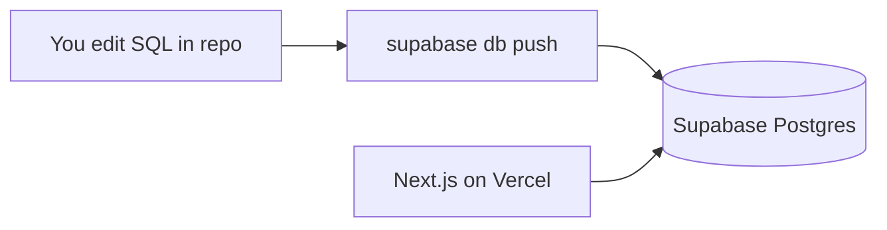

# Supabase setup — cloud project & migrations

How ChopRent SQL in this repo connects to Supabase **without** manually running scripts in the dashboard (recommended path).

---

## Do I run the SQL scripts manually?

**No — not for normal setup.** The files in `supabase/migrations/` are applied automatically by the **Supabase CLI** in filename order:

| File | Purpose |
|------|---------|
| `20260608100000_init_schema.sql` | Tables, enums, indexes, helpers |
| `20260608100001_rls_policies.sql` | Row Level Security |
| `20260608100002_storage.sql` | Receipt & document buckets |

You do **not** copy-paste these into the SQL Editor unless debugging one statement. Version-controlled migrations keep local, staging, and prod in sync.

**Optional:** `supabase/seed.sql` — sample plaza/units for **local dev only** (runs on `supabase db reset`, not on cloud push by default).

---

## Step-by-step: cloud Supabase + ChopRent

### 1. Create project

1. Go to [supabase.com/dashboard](https://supabase.com/dashboard) → **New project**
2. Choose region (e.g. closest to Nigeria / your users)
3. Set a strong DB password — store in password manager
4. Wait for project to finish provisioning

### 2. Install Supabase CLI (once per machine)

```bash
npm install -g supabase
# or: brew install supabase/tap/supabase
```

### 3. Link repo to cloud project

From repo root:

```bash
cd /Users/MAC/Desktop/next/choprent
supabase login
supabase link --project-ref YOUR_PROJECT_REF
```

`YOUR_PROJECT_REF` is in dashboard URL: `https://supabase.com/dashboard/project/<project-ref>`.

### 4. Push migrations (applies all SQL files)

```bash
supabase db push
```

CLI runs each migration once and records it in `supabase_migrations.schema_migrations`. Safe to re-run — already-applied files are skipped.

### 5. Configure the web app

Dashboard → **Project Settings → API**:

- `Project URL` → `NEXT_PUBLIC_SUPABASE_URL`
- `anon public` key → `NEXT_PUBLIC_SUPABASE_ANON_KEY`
- `service_role` key → **server only** (Vercel env, never client)

```bash
cp .env.example apps/web/.env.local
# paste values into apps/web/.env.local
```

### 6. Enable Auth providers

Dashboard → **Authentication → Providers**:

- **Email** — enable (magic link / OTP as you prefer)
- **Phone** — enable when ready for tenant SMS OTP (needs SMS provider config)

### 7. Verify

```bash
npm run dev
```

Open http://localhost:3000. In Supabase **Table Editor**, confirm tables exist (`organizations`, `sites`, `units`, `payments`, etc.).

---

## Local Supabase (optional)

For offline dev with seed data:

```bash
supabase start          # Docker required
supabase db reset       # applies migrations + seed.sql
npm run dev
```

Use local URL/keys from `supabase status`.

---

## Regenerate TypeScript types (after schema changes)

```bash
supabase gen types typescript --linked > apps/web/src/types/database.generated.ts
```

Keep hand-written types in `database.ts` until you switch to generated file.

---

## Vercel deployment

Add the same env vars in Vercel project settings:

- `NEXT_PUBLIC_SUPABASE_URL`
- `NEXT_PUBLIC_SUPABASE_ANON_KEY`
- `SUPABASE_SERVICE_ROLE_KEY` (if server actions need it later)

Add Paystack keys in Phase 1.5 when DVA is implemented.

---

## Troubleshooting

| Issue | Fix |
|-------|-----|
| `db push` permission error | Re-run `supabase login`; confirm linked project |
| Migration failed mid-way | Fix SQL file; CLI may require repair — check `supabase migration list` |
| Tables missing in dashboard | Refresh; confirm push succeeded |
| RLS blocks all reads | Expected until user has `memberships` row — Sprint 1 auth/onboarding |
| Manual SQL in dashboard | Avoid — creates drift from repo migrations |

---

## What runs where



**Rule:** Schema changes always go in a **new** `supabase/migrations/YYYYMMDDHHMMSS_description.sql` file, then `db push` — never edit production only in the dashboard.
